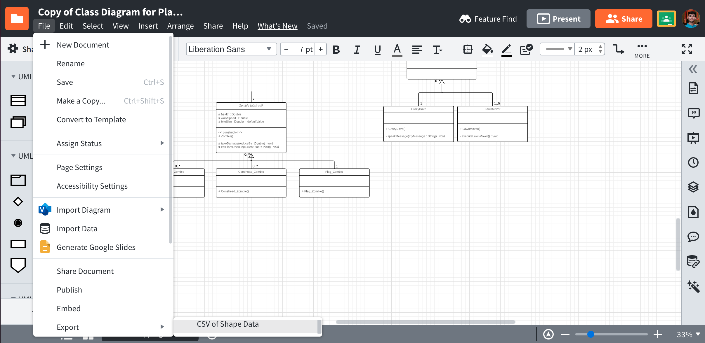
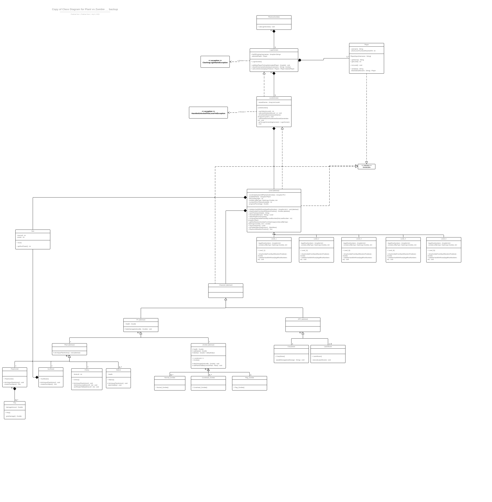

# Lucidchart-to-Java

A tool for converting UML class diagrams from Lucidchart to corresponding Java code.

# Usage
1. Download CSV file of your UML class diagram from Lucidchart.\
2. Re-name it to `input.csv` and move it to the parent directory of this repository.\
3. Run `python3 UML-to-Java.py input.csv`\
A file named `output.java` will be created in the parent repository! We are done :) \

# Images

# You should probably not be using this (lol)
UML class diagrams are made during the ideation process. They are generally not super accurate. Directly converting them to Java code may not necessarily give desirable results (unless your UML class diagram is super accurate). It is generally recommended to program the Java code while taking the help of your UML class diagram, but not copy-pasting it directly.
